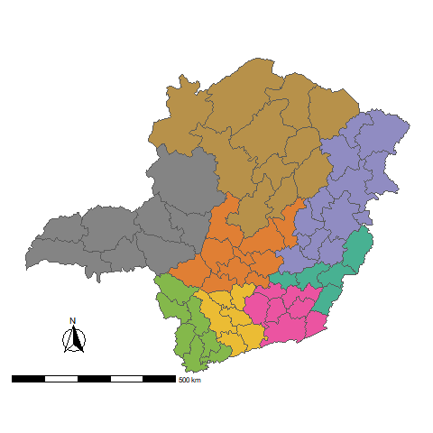
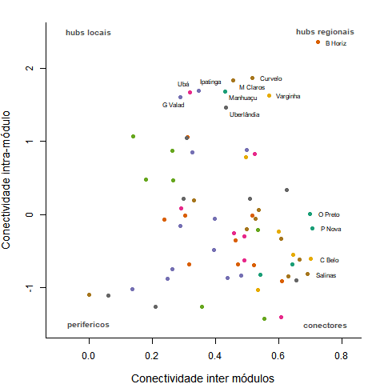

```{r setup, include=FALSE}
knitr::opts_chunk$set(echo = FALSE)
```

## Introdução

Diversos sistemas podem ser representados por meio de redes. Redes são ferramentas usadas para descrever a estrutura de sistemas formados por componentes e pela ligação entre esses componentes. Dessa forma, interações sociais, entre espécies na natureza, entre os neurônios do cérebro, ou entre os aeroportos do planeta podem ser descritas com o uso de redes [@proulx_network_2005]. 

A estrutura das redes, mesmo quando estática, pode afetar os processos dinâmicos que agem nessas redes [@thebault_stability_2010]. Por exemplo, em uma brincadeira de telefone sem fio - uma rede linear na qual os elementos são crianças conectadas lado a lado - a mensagem criada em uma ponta deve necessariamente passar por todas as crianças para chegar na outra ponta. Se as crianças estivessem organizadas em outra configuração - se a rede tivesse outra estrutura - a mensagem poderia viajar mais rapidamente ou lentamente.

Rotas rodoviárias que conectam os microrregiões brasileiras também formam redes. Da mesma forma que com a brincadeira de telefone sem fio, a estrutura dessas redes pode afetar processos dinâmicos, como o espalhamento de doenças contagiosas. Por esse motivo, investiguei a estrutura da rede de rotas rodoviárias do estado de Minas Gerais. 

## Resultados

Para estudar a estrutura da rede de rotas rodoviárias de Minas Gerais, escolhi a métrica modularidade [@olesen_modularity_2007], que identifica a presença de módulos: grupos de microrregiões que são mais conectadas entre si do que com regiões de outros módulos.

O estado de Minas Gerais é dividido em 66 microrregiões. A rede de rotas rodoviárias entre as microrregiões de Minas Gerais é composta por 8 módulos, que podem ser identificados pelas diferentes cores no mapa abaixo. Os módulos identificados correspondem à geografia do estado, de modo que microrregiões mais próximas são mais conectadas entre si do que com microrregiões mais distantes.  

```{r}

```

Durante o cálculo da modularidade, cada microrregião é afiliada a um dos modulos da rede. Usando essa informação, é possível calcular o quão importante microrregiões são em se conectar com microrregiões do seu módulo (conectividade intramódulo - z) e com microrregiões de outros módulos (conectividade intramódulo - c).    

```{r}

```

Belo Horizonte é a microrregião com maior importância estrutural, e potencialmente dinâmica, da rede de rotas rodoviárias de Minas Gerais.

# References
